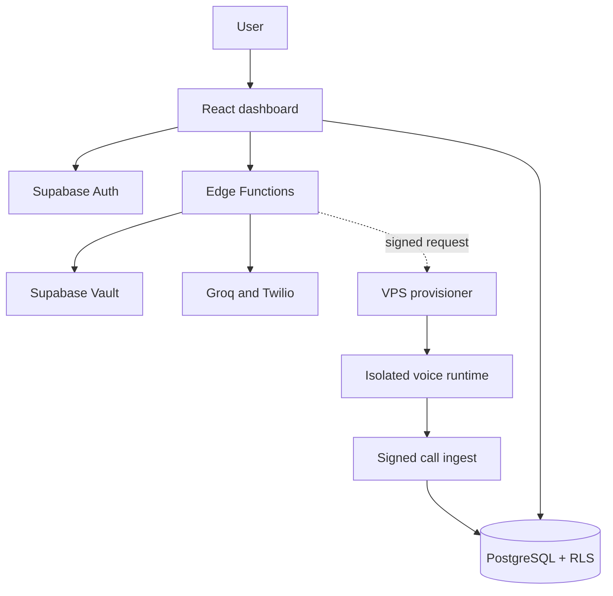

# QubeSight architecture and roadmap

Updated: 2026-09-03

## Trust boundaries



The browser is untrusted. Provider credentials, tenant authorization, provisioning commands and trusted identifiers are resolved server-side.

## Current layers

| Layer                       | Responsibility                                               |
| --------------------------- | ------------------------------------------------------------ |
| `src/pages`                 | URL screens; Dashboard currently owns too many feature views |
| `src/components`            | Shared/presentational UI and some dashboard features         |
| `src/hooks`                 | Stateful workflows such as data loading and streaming        |
| `src/lib`                   | Edge Function/client adapters                                |
| `src/integrations/supabase` | Client and generated database types                          |
| `supabase/functions`        | Trusted AI, payment and telephony boundaries                 |
| `supabase/migrations`       | Schema, RLS, RPCs and grants                                 |
| `scripts`                   | Architecture and repository policy checks                    |

## Target dashboard structure

```text
src/
  routes/
    AppRoutes.tsx
    DashboardRoutes.tsx
  layouts/
    DashboardLayout.tsx
  features/
    organization/
    overview/
    voice-agents/
    chatbots/
    telephony/
    calls/
    profile/
  components/dashboard/
  pages/
    Dashboard.tsx
    OrganizationOnboarding.tsx
```

Each feature may own components, hooks, schemas, services, types and tests. Extract along real domain boundaries; do not create empty layers.

## Target protected routes

| Route                  | Purpose                     |
| ---------------------- | --------------------------- |
| `/dashboard`           | Overview                    |
| `/dashboard/agents`    | Voice agents                |
| `/dashboard/chatbots`  | Chatbots and simulator      |
| `/dashboard/telephony` | Twilio and number selection |
| `/dashboard/calls`     | Calls                       |
| `/dashboard/profile`   | User/organization           |

Use nested React Router routes. Direct navigation and refresh must work. Preserve onboarding for authenticated users without an organization.

## Security invariants

1. Tenant rows use `organization_id` and tested RLS.
2. Owner-only actions are authorized server-side.
3. Provider secrets never enter browser-readable storage.
4. Vault identifiers/decrypted values are inaccessible to `authenticated`.
5. Public functions have explicit bounded-cost abuse controls.
6. Server inputs are schema-validated and errors expose no internals.
7. External mutations are idempotent, auditable and recoverable.
8. HMAC/JWT checks reject stale or replayed operations.
9. Logs avoid JWTs, credentials, full phones, transcripts and unnecessary PII.
10. Production actions require separate explicit authorization.

## Roadmap

### P0: establish deployable truth

- Inventory applied migrations and deployed Edge Function versions.
- Verify required secret names exist without revealing values.
- Test RLS with two organizations.
- Rotate every credential previously exposed in chat/logs.

### P1: modular dashboard

- Extract layout, onboarding, shared UI and feature sections.
- Add nested dashboard routes.
- Keep Supabase access in hooks/services.
- Add direct-refresh, route, authorization and regression tests.
- Do not mix this refactor with provisioning.

### P1: provisioning validation

- Review PR #21 against current main.
- Verify immutable runtime image, DNS/TLS, HMAC and replay defense.
- Exercise a disposable agent through provision/health/restart/stop/rollback.
- Capture and restore Twilio webhook settings during staging.

### P2: operations

- Signed idempotent call ingest with internal tenant mapping.
- Retention, redaction and consent policies.
- Deployment audit UI, quotas, alerts and reconciliation.
- Web widget, then Telegram, WhatsApp and Meta channels.

### P3: billing

- Browser submits `price_id`, never amount/currency.
- Server validates signed webhooks and persists payments idempotently.
- Provision only from trusted persisted payment state.

## Definition of done

Code existence is insufficient. Done means merged code, passing CI, deployed migration/function in the intended environment, tested authorization/failures, observability, rollback and recorded evidence.
